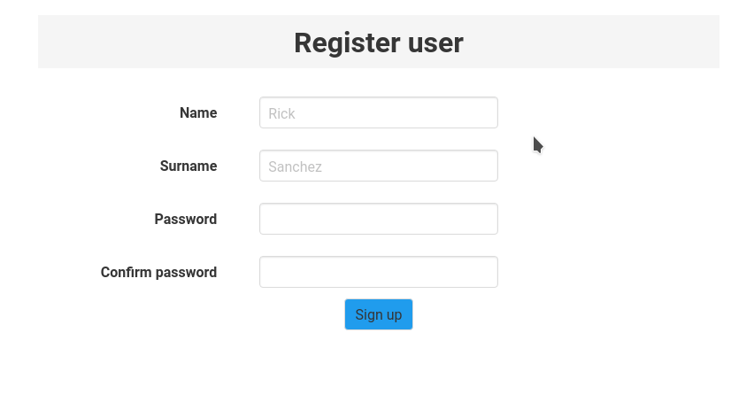
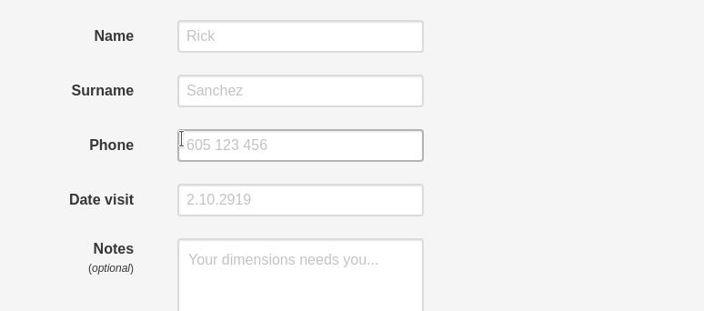

# Validatex

[](https://semaphoreci.com/s-m-i-t-a/validatex)


This library is useful for validating input forms (register / login / ...) to your web applications.

Find inspiration in [validation example](https://github.com/iodevs/validatex_example) repository or [live demo](http://validatex.herokuapp.com/).


## Installation

```elixir
def deps do
  [
    {:validatex, "~> 0.3.0"}
  ]
end
```

## Usage

If you want to use this library you have to define a few functions:
1. [Initialize](https://github.com/iodevs/validatex_example/blob/master/lib/server_web/live/user/register_live.ex#L157) of form state
2. Define [Validators](https://github.com/iodevs/validatex_example/blob/master/lib/server/validators.ex)
3. Define [form](https://github.com/iodevs/validatex_example/blob/master/lib/server_web/templates/user/register.html.leex#L14) in template
4. Define [handle_event](https://github.com/iodevs/validatex_example/blob/master/lib/server_web/live/user/register_live.ex#L110) for `on_blur` event
5. Define [handle_event](https://github.com/iodevs/validatex_example/blob/master/lib/server_web/live/user/register_live.ex#L92) for `on_change` event
6. In case of related two input forms (e.g. for password (P) and confirm password (CP)) is needed also define `handle_event` functions for `on_blur` ([P](https://github.com/iodevs/validatex_example/blob/master/lib/server_web/live/user/register_live.ex#L75)) and `on_change` ([P](https://github.com/iodevs/validatex_example/blob/master/lib/server_web/live/user/register_live.ex#L31), [CP](https://github.com/iodevs/validatex_example/blob/master/lib/server_web/live/user/register_live.ex#L75)) events.
7. For form event `phx_submit` define [handle_event](https://github.com/iodevs/validatex_example/blob/master/lib/server_web/live/user/register_live.ex#L123) function where you'll call `Validation.validate_on_submit` function for each `field_name` of your input form and then `Validation.submit_if_valid`.


## Notes

* **Pros**
  * per input form live validation
  * possibility define own validation functions
  * possible using at [Scenic](https://github.com/boydm/scenic)

* **Cons**
  * it isn't directly connected to Ecto

* Comparison
  * Using Validatex
  
  * Using `changeset` from Ecto
  


## License

Code is licensed under the BSD-4-Clause.
